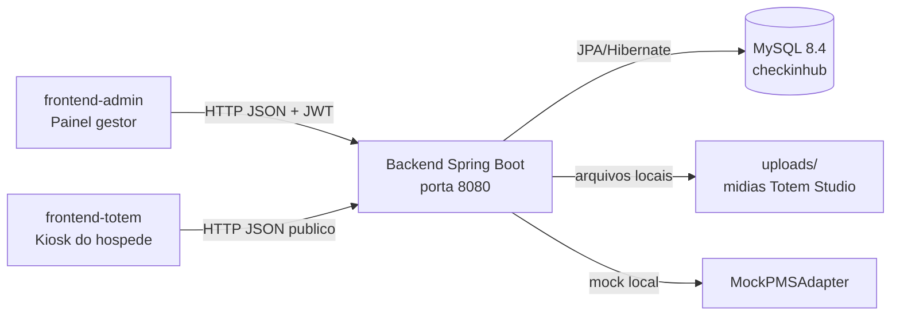
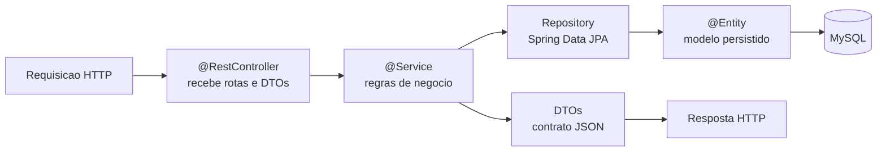
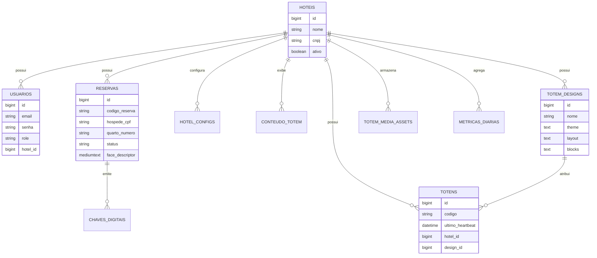
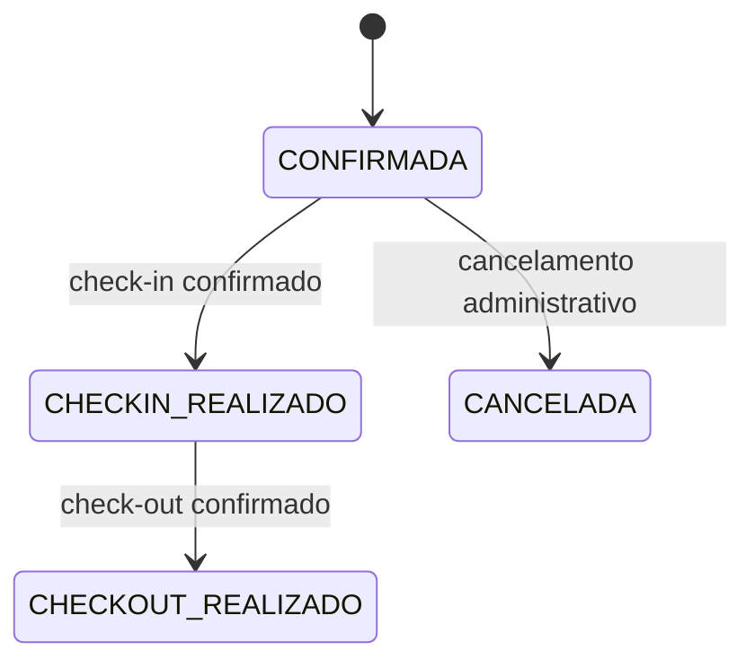
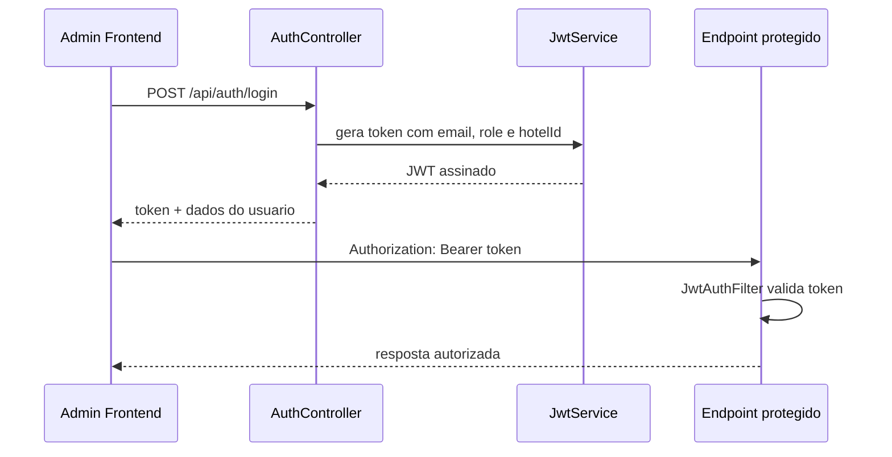
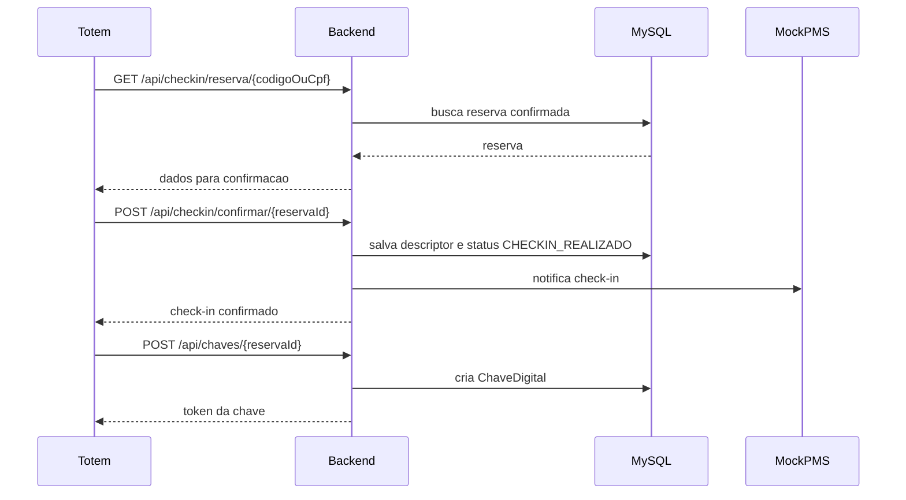
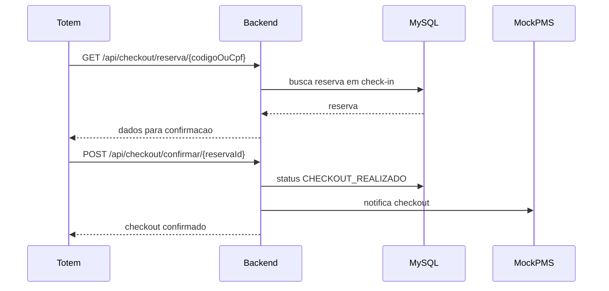
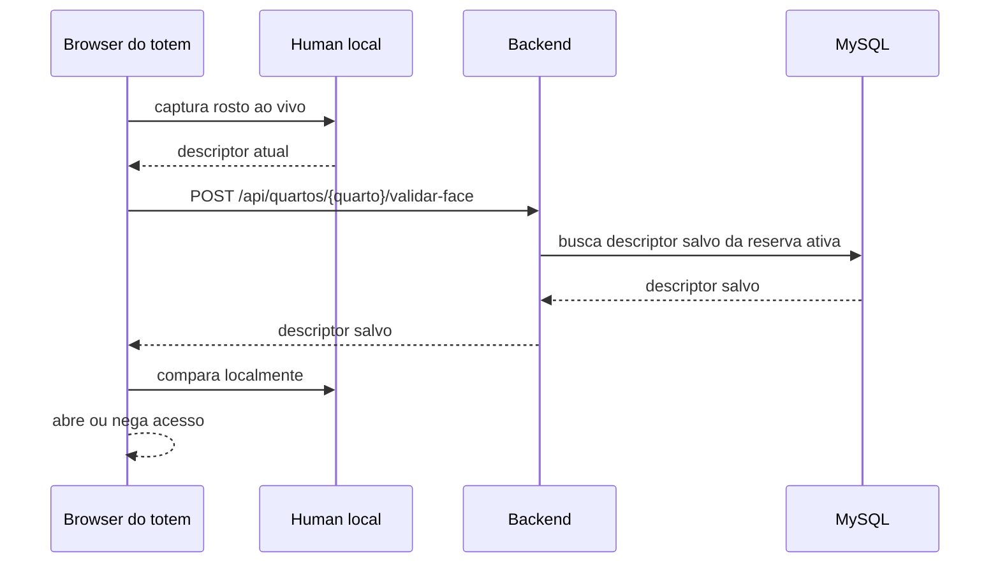
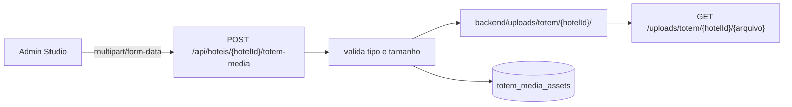

# CheckIn Hub Backend

Backend REST do projeto academico **CheckIn Hub**, desenvolvido para o FIAP Challenge Flexmedia 2025-2.

Esta aplicacao concentra as regras de negocio do sistema hoteleiro: autenticacao, administracao de hoteis, reservas, check-in, check-out, emissao de chaves digitais, controle de totens, Totem Studio, metricas e persistencia em banco MySQL.

O objetivo deste README e permitir que você avaliador entenda a construcao do backend sem precisar ler todos os arquivos Java em detalhe.

## Sumario

- [Visao geral](#visao-geral)
- [Stack tecnica](#stack-tecnica)
- [Como rodar](#como-rodar)
- [Configuracoes](#configuracoes)
- [Estrutura de pastas](#estrutura-de-pastas)
- [Arquitetura interna](#arquitetura-interna)
- [Banco de dados](#banco-de-dados)
- [Autenticacao e autorizacao](#autenticacao-e-autorizacao)
- [Modulos de negocio](#modulos-de-negocio)
- [Endpoints principais](#endpoints-principais)
- [Fluxos principais](#fluxos-principais)
- [Uploads e Totem Studio](#uploads-e-totem-studio)
- [Testes e validacao](#testes-e-validacao)
- [Comandos uteis](#comandos-uteis)

## Visao geral

O CheckIn Hub e composto por tres superficies independentes:

| Superficie | Pasta | Porta | Responsabilidade |
|---|---|---:|---|
| Backend | `backend` | `8080` | API REST, regras de negocio, JWT, MySQL, uploads |
| Totem | `frontend-totem` | `5173` | Fluxo publico do hospede em modo kiosk |
| Admin | `frontend-admin` | `5174` | Painel FlexMedia e gestor hoteleiro |

Este backend expoe uma API REST consumida pelos dois frontends. Ele nao compartilha codigo com os projetos React; a integracao acontece via HTTP/JSON.



### Responsabilidades do backend

- Centralizar regras de negocio do check-in/check-out.
- Persistir hoteis, usuarios, reservas, chaves digitais, totens, designs e metricas.
- Emitir e validar JWT para usuarios administrativos.
- Proteger endpoints administrativos por role e escopo de hotel.
- Expor endpoints publicos para o totem do hospede.
- Armazenar descriptors faciais enviados pelo frontend.
- Servir midias enviadas no Totem Studio.
- Simular integracao PMS por meio do `MockPMSAdapter`.

## Stack tecnica

| Tecnologia | Uso no projeto |
|---|---|
| Java 17 | Linguagem e runtime do backend |
| Spring Boot 3.4.4 | Base da aplicacao, servidor embutido e auto-configuracao |
| Spring Web | Controllers REST e serializacao JSON |
| Spring Security | Autenticacao, autorizacao, filtro JWT e CORS |
| Spring Data JPA | Repositories e persistencia relacional |
| Hibernate | Implementacao JPA e mapeamento entidade/tabela |
| MySQL 8.4 | Banco oficial do projeto |
| Maven | Gerenciamento de dependencias, build e testes |
| Maven Wrapper | Execucao previsivel via `./mvnw` |
| Lombok | Reducao de boilerplate em entidades, DTOs e services |
| JJWT 0.12.6 | Criacao e leitura de tokens JWT |
| H2 | Banco em memoria usado nos testes |
| Spring Boot Actuator | Health check em `/actuator/health` |
| Docker | Empacotamento e execucao local/containerizada |

Decisoes importantes:

- O banco oficial e **MySQL 8.4**.
- Os IDs usam `GenerationType.IDENTITY`, aproveitando `auto_increment` do MySQL.
- Em desenvolvimento, o Hibernate usa `spring.jpa.hibernate.ddl-auto=update`.
- Nenhuma API paga e necessaria.
- O backend **nao processa imagem facial**. Ele persiste/serve descriptors; a captura e comparacao acontecem no browser do totem com `@vladmandic/human`.
- O PMS e mockado por padrao com `app.pms.adapter=mock`.

## Como rodar

### Pre-requisitos

- Java 17
- Docker Desktop ou Docker Engine com Compose, se quiser subir MySQL via container
- MySQL local ou container MySQL 8.4
- Terminal na pasta `backend/`

### Rodar apenas o MySQL com Docker

Na raiz do repositorio:

```bash
docker-compose up mysql -d
```

O servico sobe:

| Item | Valor |
|---|---|
| Container | `checkinhub-mysql` |
| Porta | `3306` |
| Database | `checkinhub` |
| Usuario | `checkinhub` |
| Senha | `checkinhub123` |

### Rodar o backend em modo desenvolvimento

```bash
cd backend
./mvnw spring-boot:run
```

A API fica em:

```text
http://localhost:8080
```

Health check:

```bash
curl -sS http://localhost:8080/actuator/health
```

Resposta esperada:

```json
{"status":"UP"}
```

### Rodar tudo com Docker Compose

Na raiz do repositorio:

```bash
docker-compose up --build
```

Servicos:

| Servico | URL |
|---|---|
| Backend | `http://localhost:8080` |
| Totem | `http://localhost:5173` |
| Admin | `http://localhost:5174` |

Para parar:

```bash
docker-compose down
```

Para parar e apagar volumes de banco e uploads:

```bash
docker-compose down -v
```

> Atencao: `down -v` remove o volume `mysql_data` e tambem o volume `backend_uploads`, ou seja, apaga dados locais e midias enviadas no Totem Studio.

## Configuracoes

As configuracoes principais ficam em:

```text
backend/src/main/resources/application.properties
```

Principais propriedades:

| Propriedade | Valor padrao | Funcao |
|---|---|---|
| `server.port` | `8080` | Porta HTTP da API |
| `spring.datasource.url` | `jdbc:mysql://localhost:3306/checkinhub...` | URL JDBC do MySQL |
| `spring.datasource.username` | `checkinhub` | Usuario do banco |
| `spring.datasource.password` | `checkinhub123` | Senha do banco |
| `spring.jpa.hibernate.ddl-auto` | `update` | Atualizacao automatica de schema em desenvolvimento |
| `spring.jpa.show-sql` | `true` | Log de SQL no console |
| `app.jwt.secret` | valor local | Chave de assinatura JWT |
| `app.jwt.expiration-ms` | `86400000` | Expiracao do token em milissegundos |
| `app.pms.adapter` | `mock` | Adapter PMS ativo |
| `app.cors.allowed-origins` | portas locais dos frontends | Origens liberadas pelo CORS |
| `app.uploads.dir` | `uploads` | Pasta fisica de midias |
| `spring.servlet.multipart.max-file-size` | `80MB` | Tamanho maximo de arquivo |
| `management.endpoints.web.exposure.include` | `health,info` | Endpoints Actuator expostos |

As propriedades usam fallback com variaveis de ambiente. Exemplo:

```properties
spring.datasource.url=${MYSQL_URL:jdbc:mysql://localhost:3306/checkinhub?...}
spring.datasource.username=${MYSQL_USER:checkinhub}
spring.datasource.password=${MYSQL_PASS:checkinhub123}
```

Isso permite rodar localmente com os padroes e sobrescrever valores no Docker:

```yaml
environment:
  MYSQL_URL: jdbc:mysql://mysql:3306/checkinhub?createDatabaseIfNotExist=true...
  MYSQL_USER: checkinhub
  MYSQL_PASS: checkinhub123
```

## Estrutura de pastas

```text
backend/
+-- pom.xml
+-- mvnw
+-- mvnw.cmd
+-- .mvn/wrapper/maven-wrapper.properties
+-- Dockerfile
+-- src/
|   +-- main/
|   |   +-- java/br/com/flexmedia/checkinhub/
|   |   |   +-- CheckinHubApplication.java
|   |   |   +-- common/
|   |   |   +-- config/
|   |   |   +-- modules/
|   |   |   +-- pms/
|   |   |   +-- security/
|   |   +-- resources/application.properties
|   +-- test/
|       +-- java/br/com/flexmedia/checkinhub/
|       +-- resources/application-test.properties
+-- target/
+-- uploads/
```

| Caminho | Papel |
|---|---|
| `pom.xml` | Manifesto Maven com dependencias, plugins, Java 17 e regras de teste |
| `mvnw` / `mvnw.cmd` | Maven Wrapper para Linux/macOS e Windows |
| `.mvn/wrapper/` | Configuracao da versao do Maven usada pelo wrapper |
| `Dockerfile` | Build multi-stage: Maven compila, Java 17 JRE executa |
| `src/main/java` | Codigo principal da aplicacao |
| `src/main/resources` | Configuracoes carregadas em runtime |
| `src/test/java` | Testes unitarios e integracao |
| `src/test/resources` | Configuracoes dos testes |
| `target/` | Saida gerada pelo Maven: classes, JAR, relatorios |
| `uploads/` | Arquivos enviados em runtime pelo Totem Studio |

`target/` nao e fonte do projeto. Ele pode ser removido com:

```bash
./mvnw clean
```

`uploads/` tambem nao e codigo-fonte. E dado local produzido pela aplicacao.

## Arquitetura interna

O backend segue uma organizacao comum em aplicacoes Spring:



### Camadas

| Camada | Responsabilidade | Exemplo |
|---|---|---|
| Controller | Mapear endpoints HTTP e delegar regra | `ReservaController` |
| Service | Validar regras, transacoes e orquestracao | `ReservaService` |
| Repository | Consultar e persistir no banco | `ReservaRepository` |
| Entity | Representar tabela/relacionamento | `Reserva` |
| DTO | Definir JSON de entrada/saida | `ReservaRequestDTO`, `ReservaResponseDTO` |
| Config | Beans e configuracoes globais | `SecurityConfig`, `StaticUploadsConfig` |
| Exception Handler | Padronizar erros HTTP | `GlobalExceptionHandler` |

### Pacotes principais

```text
br.com.flexmedia.checkinhub
+-- common/          excecoes e handler global
+-- config/          DataLoader e arquivos estaticos de upload
+-- pms/             contrato PMSAdapter e MockPMSAdapter
+-- security/        usuarios, login, roles, JWT e autorizacao
+-- modules/
    +-- hotel/       hoteis, reservas e configuracao simples
    +-- checkin/     busca e confirmacao de check-in
    +-- checkout/    busca e confirmacao de check-out
    +-- keys/        emissao de chaves digitais
    +-- metrics/     metricas diarias e dashboard
    +-- conteudo/    conteudo legado da idle do totem
    +-- totem/       dispositivos, codigo de ativacao e heartbeat
    +-- totemdesign/ Totem Studio, presets e midias
    +-- room/        validacao de porta por descriptor facial
```

## Banco de dados

O banco oficial e MySQL 8.4. A conexao padrao usa:

```properties
spring.datasource.url=jdbc:mysql://localhost:3306/checkinhub?createDatabaseIfNotExist=true&useSSL=false&allowPublicKeyRetrieval=true&serverTimezone=America/Sao_Paulo
spring.datasource.username=checkinhub
spring.datasource.password=checkinhub123
```

### Principais entidades



| Entidade | Tabela | Papel |
|---|---|---|
| `Hotel` | `hoteis` | Cadastro de hotel e status ativo |
| `Usuario` | `usuarios` | Login administrativo com role `ADMIN` ou `OPERADOR` |
| `Reserva` | `reservas` | Dados do hospede, quarto, datas, status e descriptor facial |
| `ChaveDigital` | `chaves_digitais` | Token emitido apos check-in |
| `Totem` | `totens` | Dispositivo configurado por codigo, heartbeat e design opcional |
| `HotelConfig` | `hotel_configs` | Configuracao simples de marca, logo, cor e idiomas |
| `ConteudoTotem` | `conteudo_totem` | Conteudo legado da tela idle |
| `TotemDesign` | `totem_designs` | Preset visual nomeado do Totem Studio |
| `TotemMediaAsset` | `totem_media_assets` | Midias enviadas para uso no Totem Studio |
| `MetricaDiaria` | `metricas_diarias` | Agregados diarios por hotel |

### Estado da reserva



Estados:

- `CONFIRMADA`: reserva criada e pronta para check-in.
- `CHECKIN_REALIZADO`: hospede confirmou entrada e pode receber chave.
- `CHECKOUT_REALIZADO`: hospede confirmou saida.
- `CANCELADA`: reserva cancelada.

## Autenticacao e autorizacao

O backend usa JWT stateless:



Claims principais:

| Claim | Significado |
|---|---|
| `sub` | Email do usuario |
| `hotelId` | Hotel do operador, ou `null` para admin global |
| `role` | `ADMIN` ou `OPERADOR` |

Regras:

- `ADMIN` representa a FlexMedia e pode gerenciar hoteis e usuarios.
- `OPERADOR` representa gestor de hotel e fica restrito ao hotel vinculado.
- Endpoints administrativos exigem JWT.
- Endpoints publicos do totem nao exigem login, para permitir uso pelo hospede.
- O backend usa `CurrentUserService` para derivar escopo de hotel a partir do usuario logado.

Endpoints publicos configurados em `SecurityConfig` incluem:

- `/actuator/**`
- `/api/auth/**`
- `/api/checkin/**`
- `/api/checkout/**`
- `/api/chaves/**`
- `/api/quartos/**`
- `/api/totens/codigo/**`
- `/api/totens/*/heartbeat`
- `GET /api/hoteis/{hotelId}/config`
- `GET /uploads/**`

Os demais endpoints exigem autenticacao.

### Usuario seed

`DataLoader` cria automaticamente o admin padrao se ele ainda nao existir:

| Campo | Valor |
|---|---|
| Email | `admin@flexmedia.com` |
| Senha | `admin123` |
| Role | `ADMIN` |

## Modulos de negocio

### `modules/hotel`

Responsavel por:

- Cadastro e atualizacao de hoteis.
- Configuracao simples de totem por hotel.
- Criacao, listagem, busca, atualizacao e remocao de reservas.
- Geracao automatica de codigo de reserva.
- Restricao de reservas por escopo de hotel.

Detalhe importante: na criacao de reserva, o operador nao escolhe livremente o hotel. O backend deriva o hotel a partir do JWT do usuario logado. Isso reduz risco de um operador criar reserva em outro hotel.

### `modules/checkin`

Responsavel pelo fluxo publico de check-in:

- Buscar reserva por codigo ou CPF.
- Confirmar check-in.
- Persistir descriptor facial recebido do frontend.
- Permitir fallback por data de nascimento quando necessario.
- Atualizar status da reserva para `CHECKIN_REALIZADO`.
- Chamar o PMS mockado sem bloquear a demonstracao local em caso de falha externa.

### `modules/checkout`

Responsavel pelo fluxo publico de check-out:

- Buscar reserva por codigo ou CPF.
- Confirmar checkout.
- Atualizar status para `CHECKOUT_REALIZADO`.
- Acionar PMS mockado.

### `modules/keys`

Responsavel pela emissao de chave digital apos check-in. A entidade `ChaveDigital` registra token, tipo, validade e reserva associada.

### `modules/totem`

Responsavel por dispositivos de totem:

- Criar totens vinculados a hoteis.
- Gerar codigo de ativacao.
- Buscar configuracao publica por codigo.
- Registrar heartbeat.
- Indicar se o dispositivo esta online/offline.
- Associar opcionalmente um preset do Totem Studio ao dispositivo.

O codigo do totem e o identificador usado no setup do `frontend-totem`.

### `modules/totemdesign`

Responsavel pelo Totem Studio:

- Listar presets salvos por hotel.
- Criar preset nomeado.
- Atualizar preset.
- Persistir `theme`, `layout` e `blocks` como JSON em colunas `TEXT`.
- Fazer upload/listagem/remocao de midias.

Tambem existem endpoints legados de draft/publish no controller para compatibilidade com historico do projeto, mas o fluxo atual documentado usa presets nomeados e atribuicao opcional por totem.

### `modules/conteudo`

Modulo legado de conteudo visual do totem. Mantem conteudos ativos ordenados para a tela idle quando o runtime precisa desse contrato.

### `modules/metrics`

Responsavel por dashboard e historico de metricas diarias por hotel.

### `modules/room`

Responsavel pela validacao de porta:

- Recebe o numero do quarto.
- Busca reserva ativa com descriptor facial salvo.
- Retorna descriptor ao frontend.
- A comparacao facial acontece localmente no browser.

### `pms`

Define o contrato `PMSAdapter` e a implementacao `MockPMSAdapter`. O adapter simula integracao com PMS hoteleiro, preservando custo zero e ambiente local previsivel.

## Endpoints principais

### Auth

| Metodo | Rota | Auth | Descricao |
|---|---|---|---|
| `POST` | `/api/auth/login` | Publico | Login e emissao de JWT |
| `POST` | `/api/auth/register` | `ADMIN` | Cria usuario |
| `GET` | `/api/auth/usuarios` | `ADMIN` | Lista usuarios |
| `DELETE` | `/api/auth/usuarios/{id}` | `ADMIN` | Desativa usuario |

### Hoteis e configuracao

| Metodo | Rota | Auth | Descricao |
|---|---|---|---|
| `GET` | `/api/hoteis` | `ADMIN` | Lista hoteis |
| `GET` | `/api/hoteis/{id}` | `ADMIN` | Busca hotel por ID |
| `POST` | `/api/hoteis` | `ADMIN` | Cria hotel |
| `PUT` | `/api/hoteis/{id}` | `ADMIN` | Atualiza hotel |
| `PATCH` | `/api/hoteis/{id}/desativar` | `ADMIN` | Desativa hotel |
| `GET` | `/api/hoteis/{hotelId}/config` | Publico | Busca config simples do totem |
| `PUT` | `/api/hoteis/{hotelId}/config` | Autenticado | Salva config simples |

### Reservas

| Metodo | Rota | Auth | Descricao |
|---|---|---|---|
| `GET` | `/api/reservas` | Autenticado | Lista reservas por escopo |
| `GET` | `/api/reservas/{id}` | Autenticado | Busca reserva por ID |
| `GET` | `/api/reservas/codigo/{codigo}` | Autenticado | Busca administrativa por codigo |
| `POST` | `/api/reservas` | `OPERADOR` | Cria reserva no hotel do operador |
| `PUT` | `/api/reservas/{id}` | Autenticado | Atualiza reserva |
| `DELETE` | `/api/reservas/{id}` | Autenticado | Remove reserva |

### Fluxos publicos do hospede

| Metodo | Rota | Auth | Descricao |
|---|---|---|---|
| `GET` | `/api/checkin/reserva/{codigoOuCpf}` | Publico | Busca reserva para check-in |
| `POST` | `/api/checkin/confirmar/{reservaId}` | Publico | Confirma check-in |
| `GET` | `/api/checkout/reserva/{codigoOuCpf}` | Publico | Busca reserva para check-out |
| `POST` | `/api/checkout/confirmar/{reservaId}` | Publico | Confirma check-out |
| `POST` | `/api/chaves/{reservaId}` | Publico | Emite chave digital |
| `POST` | `/api/quartos/{quartoNumero}/validar-face` | Publico | Retorna descriptor salvo para comparacao local |

### Totens e Totem Studio

| Metodo | Rota | Auth | Descricao |
|---|---|---|---|
| `GET` | `/api/hoteis/{hotelId}/totens` | Autenticado | Lista totens do hotel |
| `POST` | `/api/hoteis/{hotelId}/totens` | Autenticado | Cria totem com `designId` opcional |
| `PUT` | `/api/totens/{id}` | Autenticado | Atualiza nome/design do totem |
| `DELETE` | `/api/totens/{id}` | Autenticado | Remove totem |
| `GET` | `/api/totens/codigo/{codigo}` | Publico | Busca config para ativacao do totem |
| `POST` | `/api/totens/{id}/heartbeat` | Publico | Atualiza heartbeat |
| `GET` | `/api/hoteis/{hotelId}/totem-designs` | Autenticado | Lista presets |
| `POST` | `/api/hoteis/{hotelId}/totem-designs` | Autenticado | Cria preset |
| `PUT` | `/api/hoteis/{hotelId}/totem-designs/{designId}` | Autenticado | Atualiza preset |
| `GET` | `/api/hoteis/{hotelId}/totem-media` | Autenticado | Lista midias |
| `POST` | `/api/hoteis/{hotelId}/totem-media` | Autenticado | Faz upload de midia |
| `DELETE` | `/api/hoteis/{hotelId}/totem-media/{assetId}` | Autenticado | Remove midia |

### Conteudo e metricas

| Metodo | Rota | Auth | Descricao |
|---|---|---|---|
| `GET` | `/api/conteudo` | Publico | Lista conteudos ativos |
| `POST` | `/api/conteudo` | Autenticado | Cria conteudo |
| `PUT` | `/api/conteudo/{id}` | Autenticado | Atualiza conteudo |
| `DELETE` | `/api/conteudo/{id}` | Autenticado | Remove conteudo |
| `GET` | `/api/metricas/dashboard` | Autenticado | Dados do dashboard |
| `GET` | `/api/metricas/historico` | Autenticado | Historico de metricas |

## Fluxos principais

### Check-in



### Check-out



### Porta com validacao facial



## Uploads e Totem Studio

O Totem Studio permite criar presets visuais e enviar midias. O backend armazena os arquivos em disco e registra metadados no MySQL.

Fluxo de upload:



Tipos aceitos:

| Tipo | Formatos | Limite |
|---|---|---:|
| Imagem | JPEG, PNG, WEBP | 8 MB |
| Video | MP4 | 80 MB |

Configuracao:

```properties
app.uploads.dir=${UPLOADS_DIR:uploads}
spring.servlet.multipart.max-file-size=80MB
spring.servlet.multipart.max-request-size=80MB
```

`StaticUploadsConfig` publica a pasta configurada em `/uploads/**`.

Em Docker, o volume `backend_uploads` e montado em `/app/uploads`, preservando as midias entre rebuilds do container.

## Testes e validacao

Os testes ficam em:

```text
backend/src/test/java/br/com/flexmedia/checkinhub
```

Configuracao de testes:

```text
backend/src/test/resources/application-test.properties
```

Nos testes, o banco usado e H2 em memoria:

```properties
spring.datasource.url=jdbc:h2:mem:checkinhub_test;DB_CLOSE_DELAY=-1;NON_KEYWORDS=VALUE
spring.jpa.hibernate.ddl-auto=create-drop
```

Isso torna os testes isolados e rapidos, sem depender do MySQL local.

### Rodar validacao

Compilar:

```bash
cd backend
./mvnw compile -q
```

Rodar testes:

```bash
cd backend
./mvnw test
```

Rodar um teste especifico:

```bash
cd backend
./mvnw -Dtest=ReservaControllerIT test
```

Empacotar JAR:

```bash
cd backend
./mvnw package
```

O Maven gera a saida em `backend/target/`.

## Comandos uteis

### Login e token JWT

```bash
curl -sS -X POST http://localhost:8080/api/auth/login \
  -H "Content-Type: application/json" \
  -d '{"email":"admin@flexmedia.com","senha":"admin123"}'
```

Para usar endpoints protegidos, envie:

```http
Authorization: Bearer <TOKEN>
```

### Health check

```bash
curl -sS http://localhost:8080/actuator/health
```

### Consultar MySQL local

Com cliente MySQL instalado:

```bash
mysql -h127.0.0.1 -P3306 -ucheckinhub -pcheckinhub123 -Dcheckinhub
```

Queries uteis:

```sql
SHOW TABLES;

SELECT id, nome, ativo
FROM hoteis;

SELECT id, codigo_reserva, hospede_nome, quarto_numero, status
FROM reservas
ORDER BY id DESC
LIMIT 10;

SELECT id, nome, codigo, ultimo_heartbeat
FROM totens
ORDER BY id DESC
LIMIT 10;

SELECT id, nome, hotel_id, status
FROM totem_designs
ORDER BY id DESC
LIMIT 10;
```

### Simular heartbeat de um totem

```bash
curl -sS -X POST http://localhost:8080/api/totens/1/heartbeat
```

Para manter um totem online em uma demonstracao local, repita a chamada periodicamente:

```bash
while true; do
  curl -sS -X POST http://localhost:8080/api/totens/1/heartbeat
  sleep 30
done
```

### Verificar portas locais

```bash
lsof -iTCP:8080 -sTCP:LISTEN -n -P
lsof -iTCP:3306 -sTCP:LISTEN -n -P
```

### Limpar build Maven

```bash
cd backend
./mvnw clean
```
